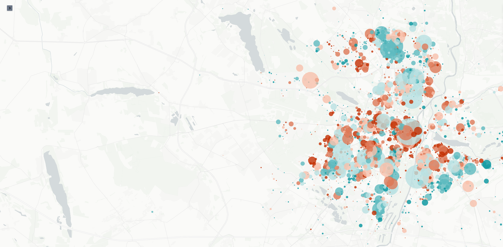

# Real_Estate_Prediction

This repository contains the code and resources for a project aimed at predicting real estate prices in Poznan, Poland, based on a variety of property features. The project leverages techniques from exploratory data analysis (EDA), natural language processing (NLP), and machine learning to build and evaluate different predictive models.



## Project Overview

The main objective of this project was to develop a model that accurately predicts the price per square meter of real estate properties in Poznan. The dataset used for this project includes various features related to the properties, such as location, description, and amenities.

## Methodology

### Exploratory Data Analysis (EDA)

During the EDA phase, we focused on understanding the dataset and preprocessing the data to ensure it was suitable for modeling. Key tasks included:

- **Data Wrangling**: Processed columns like district coordinates and `_params_` for usability, handled outliers, and removed irrelevant columns.
- **Feature Engineering**: Extracted and transformed features to improve model performance.

### Model Building

We trained and evaluated several regression models using a straightforward one-hot encoding approach for categorical variables:

- **Multiple Linear Regression**
- **Lasso Regression**
- **Random Forest**
- **XGBoost**

### Natural Language Processing (NLP)

We applied NLP techniques to extract and utilize textual data within the dataset:

- **Named Entity Recognition (NER)**: Extracted place names from the `_description_` column.
- **Text Embeddings**: Generated embeddings from several string-based columns, including `_title_`, place names, `_media_types_`, `_security_types_`, `_equipment_types_`, and `_extras_types_`.

### Neural Network
Finally, these embeddings were used to train a neural network aimed at improving the predictive performance of our models.

## Conclusion and Next Steps

The models built in this project provided a solid foundation for predicting real estate prices, but there are opportunities for improvement. Notably:

- **Reassess Districts**: The dataset contains many small and overlapping districts. Gaining more contextual knowledge or applying clustering techniques could improve the accuracy of district-related features.
- **Extract More Information from Descriptions**: Currently, only place names are extracted from the `_description_` column, but other valuable information may be present.
- **Feature Selection**: Removing low-performing variables might enhance model performance.
- **Hyperparameter Tuning**: A thorough hyperparameter search could further refine the models.
- **Explore Neural Network Architectures**: Investigating more complex neural network architectures could yield better results.
- **Define Imputation Strategy**: Rows with missing values in critical columns were removed, but developing a strategy for imputing missing values could be beneficial.

## Getting Started

To get started with this project, clone the repository and install the required dependencies:

```bash
git clone https://github.com/PerezCorrea/Real_Estate_Prediction.git
cd Real_Estate_Prediction
python -m venv venv
source venv/bin/activate
pip install -r requirements.txt
```

## Usage

The project was done in a Jupyter notebook, containing all the different stages of the analysis: `Real_Estate_POC.ipynb`

If you are reading this you should have the data. You only need to copy the real_estate_ads_2022_10.csv into the data folder and it should work. 

## License

This project is licensed under the Apache 2.0 License - see the [LICENSE](LICENSE) file for details.
